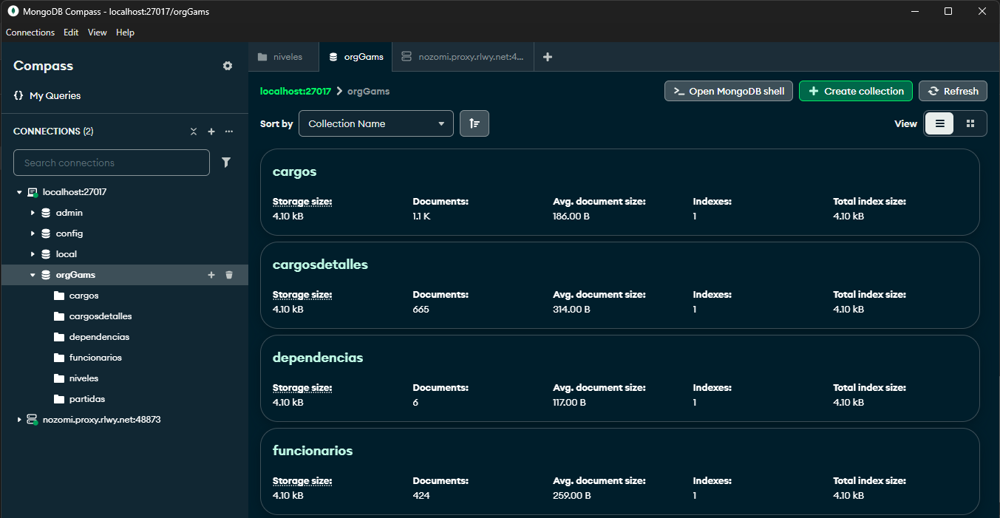

# 🧠 Backend - Automatización POA y Organigrama

Este proyecto es el backend de la aplicación web que permite automatizar el cálculo del POA (Plan Operativo Anual) a partir de la creación de cargos, niveles, dependencias y otros elementos organizacionales. Además, proporciona servicios para generar y visualizar automáticamente el organigrama institucional.

## 📦 Contenido del API

Este backend expone las siguientes rutas mediante Express:

- `/officers` → Gestión de funcionarios
- `/jobs` → Gestión de cargos
- `/levels` → Gestión de niveles jerárquicos
- `/jobdetails` → Detalle de cargos
- `/budgetarys` → Presupuesto asignado por cargo o dependencia
- `/depedences` → Dependencias organizacionales
- `/rotations` → Rotaciones y cambios de cargo
- `/consults` → Consultas y reportes personalizados

El servidor corre en el puerto:

```
http://localhost:3002/
```

## 🧰 Tecnologías utilizadas

- Node.js
- Express
- MongoDB (con Mongoose)
- dotenv
- CORS
- Nodemon (para desarrollo)

## ▶️ Instalación y ejecución

1. Clona el repositorio y entra a la carpeta del backend.
2. Instala las dependencias:

```bash
npm install
```

3. Crea un archivo `.env` con las variables necesarias como `PORT` y `MONGO_URI`.
4. Inicia el servidor:

```bash
npm run dev
```

> El servidor escuchará en el puerto definido (por defecto `3002`).

## 🗄️ Estructura de la base de datos

Aquí se visualiza el esquema general utilizado en MongoDB para la gestión de datos:



> Asegúrate de colocar la imagen del esquema en la carpeta `/assets` con el nombre `mongodb-schema.png`.
